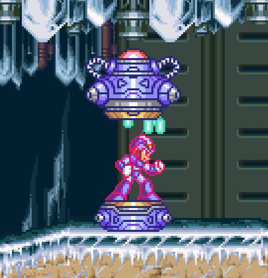

<h1 align="center">
  <br />
  
  <br />
  <b>Mega Man Robots API</b>
  <br />
  <sub
    ><sup><b>(MEGA-MAN-ROBOTS)</b></sup></sub
  >
  <br />
  <a
    href="https://github.com/felipeAguiarCode/MegaApiDotnetCore/actions/workflows/build.yml"
  >
    
  </a>
  <a href="https://github.com/felipeAguiarCode/MegaApiDotnetCore/releases/latest">
    
  </a>
</h1>

<p align="center">
  Esta API .NET Core foi projetada para fornecer dados formatados em JSON sobre os chefes da série Mega Man. É um serviço backend construído com .NET Core 3.1 e várias dependências modernas para gerenciamento de dados e manipulação de respostas de API.
  <br />
</p>

<p align="center">
  Desenvolvido com Entity Framework Core e outras tecnologias modernas .NET, este
  projeto visa fornecer uma API robusta para acessar dados dos robôs de Mega Man.
  <br />
</p>

<p align="center">
  <br />
  
</p>

## Endpoints da API

<table align="center">
  <tr>
    <th>Método</th>
    <th>Endpoint</th>
    <th>Descrição</th>
  </tr>
  <tr>
    <td>GET</td>
    <td>/api/v1/robots</td>
    <td>Retorna uma lista de todos os robôs</td>
  </tr>
  <tr>
    <td>GET</td>
    <td>/api/v1/robots/{id}</td>
    <td>Retorna detalhes de um robô específico por ID</td>
  </tr>
  <tr>
    <td>POST</td>
    <td>/api/v1/robots</td>
    <td>Endpoint para criar uma nova entrada de robô</td>
  </tr>
</table>

## Técnicas Utilizadas

<p align="center">
  - <b>Entity Framework Core:</b> ORM para gerenciamento de dados.<br />
  - <b>Design de API RESTful:</b> Garante endpoints de comunicação claros e eficazes.<br />
  - <b>Injeção de Dependência:</b> Usado em toda a aplicação para promover baixo acoplamento e maior testabilidade.<br />
</p>

## Dependências

<table align="center">
  <tr>
    <th>Pacote</th>
    <th>Versão</th>
    <th>Link</th>
  </tr>
  <tr>
    <td>Microsoft.EntityFrameworkCore</td>
    <td>3.1.8</td>
    <td>
      <a
        href="https://www.nuget.org/packages/Microsoft.EntityFrameworkCore/3.1.8"
        >NuGet</a
      >
    </td>
  </tr>
  <tr>
    <td>Microsoft.EntityFrameworkCore.Design</td>
    <td>3.1.8</td>
    <td>
      <a
        href="https://www.nuget.org/packages/Microsoft.EntityFrameworkCore.Design/3.1.8"
        >NuGet</a
      >
    </td>
  </tr>
  <tr>
    <td>Microsoft.EntityFrameworkCore.SqlServer</td>
    <td>3.1.8</td>
    <td>
      <a
        href="https://www.nuget.org/packages/Microsoft.EntityFrameworkCore.SqlServer/3.1.8"
        >NuGet</a
      >
    </td>
  </tr>
  <tr>
    <td>Newtonsoft.Json</td>
    <td>12.0.2</td>
    <td>
      <a href="https://www.nuget.org/packages/Newtonsoft.Json/12.0.2">NuGet</a>
    </td>
  </tr>
</table>

## :gear: Arquitetura

```🌐
src
├── 📂 Controllers      [Rotas para endpoints]
├── 📂 Models           [Modelos de banco de dados]
├── 📂 Services         [Regras de negócios]
├── 📂 Middlewares      [Funções intermediárias entre a solicitação HTTP e a resposta final do servidor]
├── 📂 Database         [Estruturas relacionadas ao banco de dados]
│   ├── 📂 DTOs             [Modelos de entrada e View Models (Objetos de Transferência de Dados)]
│   ├── 📂 EntityFramework  [Arquivos relacionados ao ORM Entity Framework]
│   │     ├── 📂 Context         [Configurações do contexto da entidade]
│   │     ├── 📂 Migrations      [Migrações para atualizações do banco de dados]
│   ├── 📂 Repositories     [Padrão de repositório]
